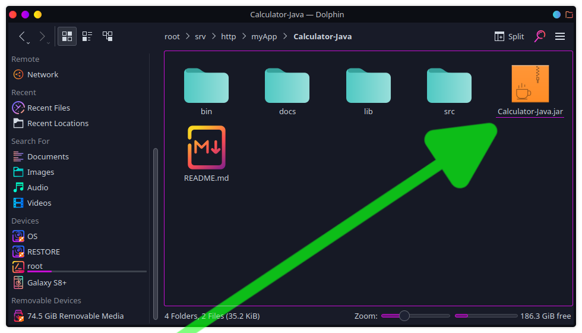
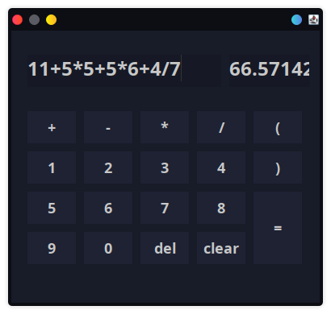
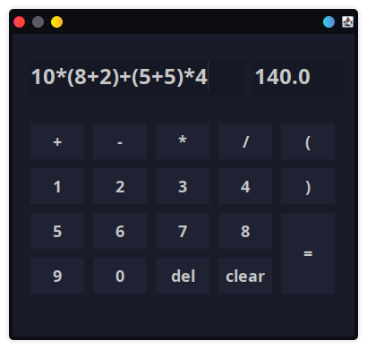

# Calculator Java

## Tentang aplikasi

Program aplikasi kalkulator dilengkapi dengan program algoritma perhitungan dalam variable string

## Tujuan pembuatan

Sekadar ingin mengasah kemampuan dan memahami cara berkerja dengan github selama proses pembuatan aplikasi ini.

## Instalasi dan penggunaan

#### 1. Install jdk versi 11 dan jre versi 11
**Arch:**
```
$ sudo pacman -S jdk11-openjdk
$ sudo pacman -S jre11-openjdk
```
**Debian:**
```
$ sudo apt-get install jdk11-openjdk
$ sudo apt-get install jre11-openjdk
```

**Windows:** <br/>
Download windows jdk installer in [web oracle](https://www.oracle.com/java/technologies/javase/jdk11-archive-downloads.html)

#### 2. Clone atau install repo pada

```
$ git clone https://github.com/MuhamadOskhar/Calculator-Java.git
```

#### 3. Run atau eksekusi program

- anda dapat menjalankan program sebagai file jar


- atau anda dapat menjalankan program pada extensi visual studio code


#### 4. Oprasikan aplikasi

Anda dapat menggunakan aplikasi kalkulator ini sebagaimana kalkulator digunakan. Para pengguna numpad tidak perlu khawatir, aplikasi ini mendukung pengetikan pada keyboard.

###### Gambar 1. Tampilan sebelum dipakai

###### Gambar 2. Mencoba menghitung beberapa angka acak

###### Gambar 3. Menghitung angka acak beserta tanda kurung
